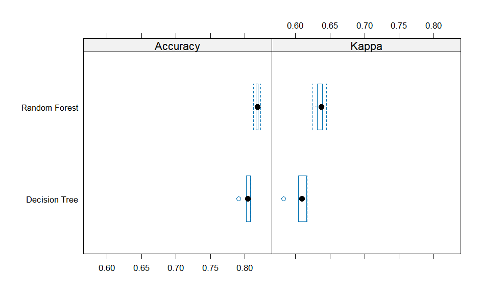

```{r}
library(tinytex)
```


```{r setup, include=FALSE}
knitr::opts_chunk$set(echo = FALSE)
```


## Graph 1-
{width="60%"}

-This plot is telling us that in the females during the seasons had more number of admissions than the males 

-As you can see the females had the most number of admissions during the spring and summer seasons 
Males had the highest number of admissions during the spring and summer as well 


## Graph 2 
{width="60%"}

-This plot tells us the females had the most number of admissions despite race.

-The Asian and American Indian women had the highest number of admissions

-The other, black, and white  category had the highest number of admissions for males


## Graph 3 
{width="60%"}

-This bar graph shows the frequency of occurrences such as visits, patients, or services associated with different healthcare providers.
-Higher frequency: Rhode Island Hospital has the highest frequency, which means it has the most cases or patients 
-Lower frequency: Bradley, Butler, and Westerly have lower frequencies, meaning they may offer more personalized services or limited amount of patients 


## Graph 4 
{width="60%"}

-We can see those who are white tend to have a higher count in the 60-90 range, and there is an outlier at age 0  

-Same thing for those who are hispanic or black there is a pretty consistent trend but there is an outlier at age 0


## Graph 5 
{width="60%"}

-This graph tells us most people despite age don't stay for more than approximately 50-100 days however the middle ages have some outliers where there stay is extended to 400 days 

-The age category 0 we can assume is infants has a steady trend which shows patients are staying between 0-150 days roughly.


## Graph 6 
{width="60%"}

-This scatter plot shows the length of stay for individual patients across the different seasons. Most stays are at the lower end of the scale, therefore shorter stay duration despite the season. 

-Indicating the seasons don't have a strong affect on the patients length of stay
--This is what I found most interesting! 


## Graph 7 
{width="60%"}

-This scatter plot tells us that age typically affects the number of days a patient is admitted into the ICU; those in the age range of 60-90 tend to have higher ICU stays and it appears to be an even spread of male and female.


## Graph 8 
{width="60%"}

-This scatter plot tells us that the total charges stay pretty constant despite age, however there is a common upward trend in the 0 age.

-We can assume the longer the stay, the higher the charge rather than age affecting the total charge.


## Graph 9 
{width="60%"}

-This shows a correlation between length of stay and total charges, the longer a patient stays the more money this will cost them, according to this chart.


## Graph 10 
{width="60%"}

-This bar graph shows the difference between number of admissions and the admission type but also categorized into gender. This shows us the emergency and urgent categories have the highest number of admissions. 

-Despite the admission type it appears females have the highest number of admissions for all categories.

## Animation Plot
{width="50%"}
-This chart shows occurrences by race and gender during the fall. Whites have the highest counts, followed by smaller numbers across other racial groups, with data split into Female, Male, and Unspecified categories.


## Accuracy & Kappa

-Plot the comparison of the models in 3.
{width="60%"}
-We can see the random forest is outperforming the decision tree in both Kappa and accuracy making it the more reliable machine learning model.


## Tree Model
{width="60%"}

This decision tree shows how variables like length of stay (los), admission type, and age influence the outcome (e.g., "high" or "low"). Each split represents a decision, provides predictions with percentages of data falling into each category.


## Bar Graph 
{width="60%"}

-Shows the los has the highest value showing the highest outcome


## Challenges 

Hard to make plots towards the later questions when certain variables had been used.

The animation plots took a little while which was challenging 

